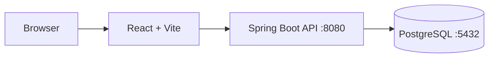
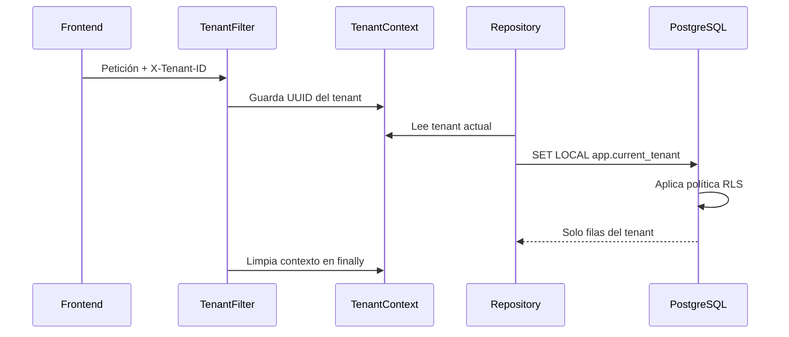
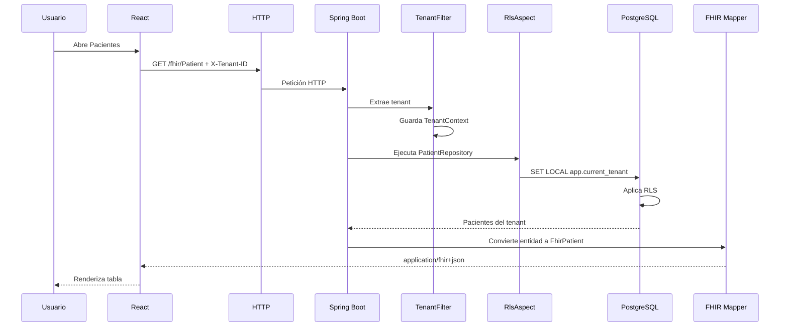

# KliniKPro Guide

Guía de aprendizaje fullstack para construir KlinikPro paso a paso

## 1. Propósito de esta guía

Esta guía acompaña la construcción de KlinikPro, una plataforma clínica SaaS multitenant. Está escrita para una persona junior que desea aprender cómo se conectan una interfaz web, una API, una base de datos, reglas de negocio, interoperabilidad clínica y despliegue.

El objetivo no es únicamente copiar archivos. En cada fase se explica:

- qué problema resuelve la fase;
- qué arquitectura se está introduciendo;
- qué archivos se crean o modifican;
- qué responsabilidad tiene cada pieza;
- cómo comprobar que la fase funciona;
- qué funcionalidades ya existen y cuáles todavía son una base para trabajo futuro.

> Importante: la rama actual contiene un esqueleto funcional y demostrativo. Algunas pantallas y flujos están preparados visualmente, pero todavía no implementan autenticación real, CRUD completo ni todas las operaciones de agenda. La guía distingue explícitamente entre lo implementado y lo pendiente.

---

## 2. Qué vamos a construir

KlinikPro es una aplicación clínica orientada a organizaciones que pueden tener una o varias sucursales. Sus conceptos principales son:

- **Tenant:** una clínica u organización cliente.
- **Branch:** una sucursal perteneciente a un tenant.
- **AppUser:** una persona que accede al sistema dentro de un tenant.
- **Patient:** paciente de una sucursal.
- **Practitioner:** profesional que atiende pacientes.
- **Appointment:** cita entre un paciente y un profesional.
- **ClinicalData:** información clínica flexible almacenada como JSONB y relacionada con FHIR.

La aplicación tiene tres grandes superficies:

1. **Frontend:** React, TypeScript, Vite, React Router, Tailwind CSS y Lucide React.
2. **Backend:** Java 17, Spring Boot, Spring Web, Spring Data JPA, Spring Security, AOP, Flyway y HAPI FHIR.
3. **Infraestructura:** PostgreSQL, pgAdmin, Docker, Docker Compose y GitHub Actions.

### Resultado esperado al terminar las seis fases

Al llegar al commit de la fase 6 tendremos:

- una base de datos PostgreSQL versionada con Flyway;
- tablas clínicas y políticas de Row-Level Security;
- contexto de tenant transportado por `X-Tenant-ID`;
- entidades JPA para el dominio principal;
- prevención de solapamientos de citas en el servicio;
- un endpoint FHIR de lectura y búsqueda de pacientes;
- almacenamiento clínico flexible con JSONB;
- una interfaz React con login visual, dashboard, agenda y pacientes;
- imágenes Docker para backend y frontend;
- un `docker-compose.yml` para levantar el entorno completo;
- un pipeline CI que compila backend y frontend.

---

## 3. Requisitos previos

Instala estas herramientas antes de comenzar:

- Git;
- Java 17;
- Maven 3.8 o superior;
- Node.js 20 recomendado;
- npm;
- Docker Desktop con Docker Compose;
- un editor como VS Code;
- una herramienta para realizar peticiones HTTP, por ejemplo Postman, Insomnia o `curl`.

Comprueba las versiones desde PowerShell:

```powershell
git --version
java -version
mvn -version
node --version
npm --version
docker --version
docker compose version
```

### Conceptos que conviene conocer

No es necesario dominar todo antes de comenzar, pero será útil conocer:

- Java y clases orientadas a objetos;
- HTTP, URLs, métodos GET y POST y códigos de estado;
- SQL básico;
- React y componentes;
- JSON;
- Git y ramas;
- variables de entorno y contenedores.

---

## 4. Cómo estudiar el repositorio

La raíz del proyecto es:

```text
KlinikPro-Cytohelix-Gemini/
├── backend/
├── frontend/
├── docker-compose.yml
├── README.md
└── KliniKPro-Guide.md
```

El backend usa paquetes organizados por responsabilidad de negocio:

```text
backend/src/main/java/com/cytohelix/klinikpro/
├── config/security/
├── domain/
│   ├── appointment/
│   ├── clinical/
│   ├── patient/
│   ├── practitioner/
│   ├── tenant/
│   └── user/
├── fhir/
│   ├── common/
│   ├── config/
│   ├── controller/
│   ├── dto/
│   └── mapper/
└── KlinikProApplication.java
```

Esta organización se acerca a un enfoque **package by feature**: las clases de una funcionalidad permanecen juntas. Es más fácil localizar el código de pacientes o citas que en una estructura global con carpetas únicas para todos los controladores, servicios y repositorios.

El frontend se organiza así:

```text
frontend/src/
├── api/
├── components/
├── layouts/
├── pages/
├── App.tsx
├── main.tsx
├── App.css
└── index.css
```

- `pages` contiene vistas navegables.
- `layouts` contiene estructura compartida, como el menú lateral.
- `api` centraliza las peticiones al backend.
- `components` queda preparado para componentes reutilizables.

---

# Fase 1. Scaffolding inicial

**Commit de inicio:** `da3b564 chore: initial commit - phase 1 scaffolding (spring boot, react, docker-compose)`

## 1.1. Objetivo de la fase

Crear el esqueleto mínimo de una aplicación fullstack. Todavía no se busca resolver todo el dominio clínico. La prioridad es que existan tres piezas separadas y reconocibles:

- una API Java que pueda arrancar;
- una aplicación React que pueda compilar;
- una base PostgreSQL disponible con Docker.

Este orden evita empezar escribiendo lógica de negocio sin tener una forma de ejecutar y validar el proyecto.

## 1.2. Arquitectura introducida

El navegador será el cliente. El frontend React se comunicará con el backend mediante HTTP. El backend se conectará a PostgreSQL.



En desarrollo local, React suele ejecutarse con Vite y PostgreSQL con Docker. En el entorno completo, Docker puede ejecutar también backend y frontend.

## 1.3. Backend inicial

El archivo `backend/pom.xml` define el proyecto Maven y sus dependencias. En esta etapa son importantes:

- `spring-boot-starter-web`: crea endpoints HTTP y configura el servidor embebido;
- `spring-boot-starter-data-jpa`: permite trabajar con entidades y repositorios;
- `postgresql`: driver JDBC para conectarse a PostgreSQL;
- `flyway-core`: ejecuta migraciones versionadas;
- `spring-boot-starter-test`: base para pruebas futuras.

`KlinikProApplication.java` contiene la clase principal y la anotación `@SpringBootApplication`. Esta anotación combina configuración, descubrimiento de componentes y configuración automática.

## 1.4. Configuración de conexión

`backend/src/main/resources/application.yml` configura:

- nombre de la aplicación: `klinikpro`;
- URL JDBC local: `jdbc:postgresql://localhost:5432/klinikpro`;
- usuario `kpro_admin`;
- puerto HTTP `8080`;
- `ddl-auto: validate`, para que Hibernate valide el esquema sin modificarlo;
- Flyway habilitado.

La decisión `ddl-auto: validate` es importante: el esquema se controla mediante migraciones SQL, no mediante cambios automáticos de Hibernate. Esto hace que la estructura de base de datos sea visible, revisable y reproducible.

## 1.5. Primera migración

`V1__init_schema_with_rls.sql` crea las tablas base:

- `tenant`;
- `branch`;
- `app_user`;
- `clinical_data`.

También habilita RLS en tablas que contienen información dependiente del tenant. En esta primera versión, `patient` y `practitioner` aparecen en la migración siguiente porque se incorporan en la fase 2.

Flyway detecta los nombres con el formato `V1__descripcion.sql`, `V2__descripcion.sql`, etc. Cada migración se aplica una vez y queda registrada en la tabla de historial de Flyway.

## 1.6. Frontend inicial

La carpeta `frontend` es una aplicación Vite con React y TypeScript.

- `main.tsx` monta React en el elemento raíz del HTML.
- `App.tsx` define la composición inicial.
- `index.css` y `App.css` contienen estilos globales.
- `vite.config.ts` configura Vite.
- `tailwind.config.js` y PostCSS preparan estilos utilitarios.

El frontend y el backend son proyectos separados. Esto permite que cada uno tenga su propio ciclo de instalación, compilación y despliegue.

## 1.7. Pasos para reproducir la fase

Desde la raíz:

```powershell
git checkout da3b564
docker compose up -d db pgadmin
docker compose ps
```

En otra terminal, arranca el backend:

```powershell
cd backend
mvn spring-boot:run
```

En otra terminal, arranca el frontend:

```powershell
cd frontend
npm install
npm run dev
```

Abre la URL que indique Vite, normalmente `http://localhost:5173`.

## 1.8. Qué comprobar

- PostgreSQL aparece como `running` en `docker compose ps`.
- pgAdmin queda disponible en `http://localhost:5050`.
- El backend arranca en `http://localhost:8080`.
- Maven compila sin error:

```powershell
cd backend
mvn clean package
```

- El frontend compila:

```powershell
cd frontend
npm run build
```

## 1.9. Funcionalidad de esta fase

**Disponible:** estructura ejecutable, configuración de base de datos, migración inicial, aplicación React inicial.

**Todavía no disponible:** usuarios reales, login real, pacientes completos, citas, endpoints de negocio, aislamiento probado entre tenants y despliegue de producción.

---

# Fase 2. Dominio y multitenancy con RLS

**Commit de inicio:** `bbff101 feat: implement phase 2 - domain entities and multitenancy RLS context`

## 2.1. Objetivo de la fase

Introducir el dominio clínico y el aislamiento por tenant. En una aplicación SaaS, varios clientes pueden compartir la misma base de datos, pero un cliente nunca debe poder consultar información de otro.

La regla conceptual es:

```text
Una consulta debe devolver únicamente filas cuyo tenant_id sea igual al tenant de la petición.
```

No se debe confiar solamente en que cada desarrollador recuerde agregar `WHERE tenant_id = ...` a cada consulta. La base de datos debe actuar como una segunda barrera mediante Row-Level Security.

## 2.2. Modelo de dominio

### `Tenant`

Representa una clínica u organización. Es la raíz de aislamiento.

### `Branch`

Representa una sucursal. Tiene `tenant_id`, por lo que pertenece a una organización concreta.

### `AppUser`

Representa un usuario del sistema. Tiene usuario, hash de contraseña y rol. El modelo existe, pero la autenticación aún no se conecta a una pantalla de login real.

### `Practitioner`

Representa un profesional. Contiene nombre, especialización y una marca de baja lógica.

### `Patient`

Representa un paciente. Se relaciona con tenant, sucursal y profesional tratante. Incluye código, nombre, teléfono, fecha de nacimiento y baja lógica.

## 2.3. Migración de pacientes y profesionales

`V2__add_patient_practitioner.sql` crea:

- `practitioner`;
- `patient`;
- claves foráneas hacia `tenant`, `branch` y `practitioner`;
- políticas RLS para ambas tablas.

Las claves foráneas protegen la integridad referencial. Por ejemplo, un paciente no puede apuntar a una sucursal inexistente.

La columna `baja_logica` evita eliminar necesariamente el registro. En una aplicación clínica, conservar la historia puede ser más importante que borrar físicamente la fila. En una siguiente evolución habría que aplicar esta marca de forma consistente en las consultas.

## 2.4. Cómo viaja el tenant por la petición

El flujo se implementa en tres clases:

1. `TenantFilter` lee la cabecera HTTP `X-Tenant-ID`.
2. `TenantContext` almacena temporalmente el UUID en un `ThreadLocal`.
3. `RlsAspect` lee ese contexto antes de ejecutar un método de repositorio y establece `app.current_tenant` en PostgreSQL.



### Por qué se usa `ThreadLocal`

Cada petición HTTP se procesa normalmente en un hilo. `ThreadLocal` permite que las capas internas consulten el tenant actual sin pasar el UUID como argumento por todos los métodos.

### Por qué se limpia el contexto

Los servidores reutilizan hilos. Si no se ejecuta `TenantContext.clear()` al terminar la petición, el siguiente usuario que reciba ese hilo podría heredar accidentalmente el tenant anterior. El bloque `finally` evita ese problema.

## 2.5. Cómo funciona la política RLS

La migración define políticas similares a:

```sql
CREATE POLICY tenant_isolation_patient ON patient
FOR ALL USING (
  tenant_id = NULLIF(current_setting('app.current_tenant', true), '')::uuid
);
```

La base de datos compara la columna `tenant_id` de cada fila con el valor de sesión que estableció el backend. Si no hay tenant, la configuración queda vacía y la condición no coincide con una fila válida.

> Nota de seguridad para una versión productiva: el valor usado en `SET LOCAL` debe parametrizarse o validarse con una API segura de PostgreSQL. También debe existir autenticación real que determine el tenant en el servidor; aceptar cualquier UUID enviado libremente por el navegador es adecuado solo para este prototipo educativo.

## 2.6. Pasos para reproducir la fase

```powershell
git checkout bbff101
docker compose up -d db
cd backend
mvn spring-boot:run
```

Consulta las migraciones aplicadas desde PostgreSQL o pgAdmin. La tabla `flyway_schema_history` debe mostrar `V1` y `V2`.

## 2.7. Qué comprobar

- Existen las tablas `tenant`, `branch`, `app_user`, `clinical_data`, `practitioner` y `patient`.
- `patient` y `practitioner` tienen `tenant_id`.
- Las tablas multitenant tienen RLS habilitado.
- El filtro no conserva el tenant después de finalizar la petición.
- Un repositorio ejecutado con tenant A no debe devolver filas de tenant B.

Para comprobar esta última regla correctamente se necesitan datos de prueba de dos tenants y pruebas de integración. Esa cobertura todavía debe agregarse al proyecto.

## 2.8. Funcionalidad de esta fase

**Disponible:** entidades principales, migraciones, relaciones SQL, contexto de tenant y mecanismo RLS.

**Todavía pendiente:** autenticación JWT o sesión, autorización por rol, creación de tenants, endpoints CRUD completos, pruebas automáticas de aislamiento y control de acceso al encabezado `X-Tenant-ID`.

---

# Fase 3. FHIR y motor anti-colisiones

**Commit de inicio:** `a8126d1 feat: implement phase 3 - fhir layer and anti collision engine`

## 3.1. Objetivo de la fase

Resolver dos necesidades clínicas diferentes:

1. Proteger la agenda de un profesional contra citas que se cruzan.
2. Exponer pacientes en una representación interoperable basada en FHIR.

FHIR permite que sistemas clínicos intercambien recursos con una estructura conocida. Internamente podemos usar nuestro modelo `Patient`; externamente podemos publicar un recurso FHIR.

## 3.2. Citas y prevención de solapamientos

`V3__add_appointment.sql` crea la tabla `appointment` con:

- tenant;
- sucursal;
- paciente;
- profesional;
- estado;
- `start_time`;
- `end_time`.

La entidad `AppointmentRepository` proporciona una consulta para localizar citas del mismo profesional cuyo intervalo se cruza con el nuevo intervalo.

El servicio ejecuta este flujo:

```text
1. Recibir una cita.
2. Buscar citas existentes del mismo profesional que se solapen.
3. Si hay alguna, rechazar la operación.
4. Si no hay ninguna, guardar la cita.
```

`AppointmentService.create` está marcado con `@Transactional`. Esto agrupa la comprobación y el guardado en una unidad transaccional.

La regla de intervalos que debe aprenderse es:

```text
Existe solapamiento si:
existente.inicio < nueva.fin
y existente.fin > nueva.inicio
```

Así, una cita de 10:00 a 11:00 no colisiona con otra que comienza exactamente a las 11:00, pero sí con una que comienza a las 10:30.

### Ejemplo de escenario

- Cita existente: 09:00 - 10:00.
- Nueva cita: 09:30 - 10:30.
- Resultado: rechazada.

- Cita existente: 09:00 - 10:00.
- Nueva cita: 10:00 - 11:00.
- Resultado: permitida, según la regla de límites no superpuestos.

## 3.3. Capa FHIR

La carpeta `fhir` separa la interoperabilidad del modelo interno:

- `fhir/common`: tipos reutilizables como `Identifier`, `HumanName`, `ContactPoint`, `Meta` y `Reference`;
- `fhir/dto/FhirPatient`: forma pública del paciente;
- `fhir/mapper/PatientFhirMapper`: convierte entidad interna a DTO FHIR;
- `fhir/controller/FhirPatientController`: publica endpoints HTTP;
- `fhir/config/FhirSystems`: centraliza identificadores de sistemas FHIR.

La separación mediante mapper evita que la entidad JPA quede acoplada a la forma exacta de una API externa. Si mañana cambia el formato público, se puede modificar el DTO y el mapper sin rediseñar necesariamente las tablas.

## 3.4. Endpoints disponibles

El controlador publica `application/fhir+json`:

```text
GET /fhir/Patient
GET /fhir/Patient/{id}
```

El primer endpoint busca pacientes visibles para el tenant actual y los transforma a FHIR. El segundo obtiene un paciente por UUID y lo transforma.

Una petición de ejemplo es:

```powershell
$headers = @{ "X-Tenant-ID" = "f47ac10b-58cc-4372-a567-0e02b2c3d479" }
Invoke-RestMethod -Uri "http://localhost:8080/fhir/Patient" -Headers $headers
```

El UUID debe existir realmente en la base de datos de prueba.

## 3.5. Qué comprobar

Para el motor anti-colisiones, la prueba mínima debe crear:

- un tenant;
- un profesional;
- una primera cita;
- una segunda cita con intervalo superpuesto.

La segunda operación debe lanzar el error de colisión. También hay que probar una cita contigua, una cita completamente contenida y una cita que contiene a otra.

Para FHIR, comprobar:

- `Content-Type: application/fhir+json`;
- que el paciente tenga `id`;
- que el nombre, identificador y teléfono salgan del modelo interno;
- que un tenant no pueda obtener pacientes de otro tenant.

## 3.6. Funcionalidad de esta fase

**Disponible:** tabla de citas, consulta de solapamientos, servicio transaccional de creación, endpoint FHIR de lectura y búsqueda de pacientes.

**Todavía pendiente:** controladores REST de citas, creación de pacientes por API, paginación, parámetros de búsqueda FHIR, manejo uniforme de errores y pruebas automatizadas de todos los intervalos.

---

# Fase 4. Datos clínicos JSONB y validación FHIR

**Commit de inicio:** `42f3537 feat: implement phase 4 - clinical data JSONB model and FHIR validation`

## 4.1. Objetivo de la fase

Los datos clínicos no siempre tienen la misma estructura. Una consulta general, una nota de enfermería y un resultado de laboratorio pueden requerir campos diferentes. Guardar cada variación en columnas rígidas puede producir muchas migraciones y tablas demasiado específicas.

`ClinicalData` permite almacenar un documento clínico como JSONB en PostgreSQL, manteniendo:

- una columna `tenant_id` para aislamiento;
- una referencia al paciente;
- una referencia opcional al encuentro;
- el payload clínico flexible;
- fecha de creación.

## 4.2. Por qué JSONB

JSONB es un tipo binario de PostgreSQL que conserva una estructura JSON consultable. Es distinto de guardar texto JSON sin estructura: PostgreSQL puede validar y consultar el contenido con operadores JSONB y crear índices especializados.

El modelo híbrido utilizado es deliberado:

- datos de seguridad y relaciones: columnas normales;
- contenido clínico variable: `fhir_payload` JSONB.

Esta estrategia permite encontrar rápidamente el paciente propietario del dato sin perder flexibilidad en el documento clínico.

## 4.3. Servicio de datos clínicos

`ClinicalDataService` centraliza las operaciones de aplicación sobre el registro clínico. Su responsabilidad debe ser:

- recibir el payload validado;
- asociarlo al tenant actual;
- asociarlo a un paciente válido;
- guardar o consultar mediante el repositorio;
- impedir que una operación mezcle datos entre tenants.

El servicio es el lugar correcto para reglas de negocio. El repositorio debe centrarse en persistencia y el controlador en HTTP.

## 4.4. Configuración FHIR

`FhirValidationConfig` prepara la validación de recursos mediante HAPI FHIR. La idea general es:

```text
JSON recibido -> parser FHIR -> validación -> servicio clínico -> JSONB
```

La validación debe ocurrir antes de persistir. De esa manera no se almacenan documentos que el sistema no puede interpretar como recursos FHIR válidos.

En una implementación más completa conviene diferenciar:

- JSON inválido;
- recurso FHIR desconocido;
- recurso conocido pero inválido;
- recurso válido pero incompatible con el paciente o tenant indicado.

Cada caso debería producir un error HTTP claro, por ejemplo `400 Bad Request` para un payload mal formado.

## 4.5. Ejemplo conceptual de payload

```json
{
  "resourceType": "Observation",
  "status": "final",
  "code": {
    "text": "Presión arterial"
  },
  "subject": {
    "reference": "Patient/123"
  }
}
```

Este documento puede almacenarse en `clinical_data.fhir_payload`, mientras que la relación interna usa `patient_id` y `tenant_id`.

## 4.6. Qué comprobar

- El JSON se rechaza si no es parseable.
- Un recurso válido queda asociado al paciente correcto.
- El registro queda visible solo para el tenant correspondiente.
- El payload original se conserva sin perder campos clínicos.
- La base contiene `JSONB`, no un texto sin tipo.

## 4.7. Funcionalidad de esta fase

**Disponible:** entidad y repositorio para datos clínicos, almacenamiento JSONB y configuración de validación FHIR.

**Todavía pendiente:** endpoint público completo para alta y lectura de datos clínicos, perfiles FHIR personalizados, índices JSONB, auditoría de acceso, cifrado y pruebas de validación con recursos reales.

---

# Fase 5. Dashboard React, rutas y cliente FHIR

**Commit de inicio:** `a47fb30 feat: implement phase 5 - frontend react dashboard, routing and fhir API client`

## 5.1. Objetivo de la fase

Construir la primera experiencia de usuario que consuma el backend. La interfaz debe permitir visualizar el producto y demostrar el flujo tenant -> API -> datos FHIR.

## 5.2. Enrutamiento

`App.tsx` usa `BrowserRouter`, `Routes` y `Route`.

Las rutas actuales son:

```text
/                         LoginPage
/dashboard                DashboardLayout + AgendaPage
/dashboard/patients       DashboardLayout + PatientsPage
/dashboard/finances       Placeholder de Finanzas
```

`DashboardLayout` contiene la navegación persistente y utiliza `Outlet` para renderizar la página hija. Este patrón evita duplicar sidebar y encabezado en cada pantalla.

## 5.3. Login actual y advertencia importante

`LoginPage` recoge usuario, contraseña y tenant ID, pero el login actual es simulado:

1. el usuario introduce un tenant ID;
2. el frontend lo guarda en `localStorage` como `tenant_id`;
3. navega a `/dashboard`.

No hay una petición de autenticación al backend y usuario/contraseña no se validan. Esto sirve para probar el flujo visual y el envío del contexto tenant, pero no es seguridad real.

La evolución correcta debe incluir:

- endpoint de autenticación;
- contraseña almacenada con hash seguro;
- sesión o JWT;
- tenant derivado de la identidad autenticada;
- protección de rutas frontend;
- autorización backend por rol.

## 5.4. Cliente HTTP

`frontend/src/api/client.ts` centraliza `fetch`.

Su funcionamiento es:

1. obtiene `tenant_id` desde `localStorage`;
2. añade `Content-Type: application/json`;
3. añade `X-Tenant-ID` si existe;
4. realiza la petición contra `http://localhost:8080`;
5. lanza un error si la respuesta no es exitosa;
6. devuelve `null` para `204` o JSON para el resto.

Centralizar este comportamiento es mejor que repetir la cabecera manualmente en cada pantalla.

## 5.5. Página de pacientes

`PatientsPage` carga pacientes con:

```text
GET /fhir/Patient
```

El resultado se muestra como tabla con:

- folio desde `identifier[0].value`;
- nombre desde `name[0].text`;
- teléfono desde `telecom[0].value`;
- estado desde `active`.

Si la API falla o no devuelve pacientes, la página muestra un estado vacío. La captura del error actual es útil durante desarrollo, pero una aplicación real necesita un estado de error visible y accionable.

## 5.6. Página de agenda

`AgendaPage` presenta la intención funcional de la agenda:

- calendario médico;
- próximas citas;
- referencia visual al motor anti-colisiones.

La agenda actual es una maqueta con datos fijos. Todavía no consulta `AppointmentService` ni permite crear, editar o cancelar citas.

## 5.7. Pasos para reproducir la fase

```powershell
git checkout a47fb30
cd frontend
npm install
npm run dev
```

Con el backend activo y un `tenant_id` preparado:

1. abre la página de inicio;
2. introduce un UUID de tenant;
3. introduce cualquier usuario y contraseña, porque el login es simulado;
4. entra al dashboard;
5. abre `Pacientes`;
6. observa la petición `GET /fhir/Patient` en las herramientas de desarrollador del navegador;
7. revisa que incluya `X-Tenant-ID`.

## 5.8. Qué comprobar

- La ruta desconocida redirige a `/`.
- El layout aparece en las rutas internas.
- El logout elimina `tenant_id` y vuelve al login.
- El cliente HTTP añade el header esperado.
- La página de pacientes interpreta la respuesta FHIR.
- La compilación TypeScript finaliza correctamente:

```powershell
npm run build
```

## 5.9. Funcionalidad de esta fase

**Disponible:** navegación, layout, login visual, persistencia del tenant en el navegador, consumo de pacientes FHIR y vistas iniciales.

**Todavía pendiente:** login real, guardas de ruta, estados de carga y error completos, creación/edición de pacientes, agenda conectada a API, finanzas y manejo centralizado de sesión.

---

# Fase 6. Docker y CI

**Commit de inicio:** `700e4ae feat: implement phase 6 - dockerfiles and github actions ci`

## 6.1. Objetivo de la fase

Hacer que el proyecto se pueda construir de manera consistente en contenedores y comprobar automáticamente en GitHub Actions.

Hasta esta fase, una persona necesita instalar Java, Maven, Node y PostgreSQL en su equipo. Docker reduce esas diferencias. CI permite detectar que una modificación rompió la compilación antes de integrarla.

## 6.2. Docker Compose

`docker-compose.yml` define cuatro servicios:

### `db`

- imagen `postgres:16-alpine`;
- base `klinikpro`;
- usuario `kpro_admin`;
- puerto local `5432`;
- volumen `pgdata` para conservar datos.

### `pgadmin`

- herramienta visual para administrar PostgreSQL;
- puerto local `5050`;
- depende de `db`.

### `backend`

- se construye desde `backend/Dockerfile`;
- publica el puerto `8080`;
- usa `db` como hostname, no `localhost`;
- recibe credenciales mediante variables de entorno.

### `frontend`

- se construye desde `frontend/Dockerfile`;
- publica el puerto `80`;
- depende del backend.

Dentro de una red Docker, `localhost` significa el contenedor actual. Por eso el backend usa `jdbc:postgresql://db:5432/klinikpro`: `db` es el nombre resoluble del servicio PostgreSQL.

## 6.3. Dockerfile del backend

El backend utiliza una compilación multi-stage:

1. imagen Maven con JDK 17 para descargar dependencias y empaquetar;
2. imagen JRE Alpine más pequeña para ejecutar el `.jar`.

La ventaja es no llevar Maven ni todo el JDK a la imagen final.

## 6.4. Dockerfile del frontend

El frontend también usa dos etapas:

1. Node 20 instala dependencias y ejecuta `npm run build`;
2. Nginx sirve los archivos estáticos de `dist`.

La directiva `try_files ... /index.html` es necesaria para React Router. Sin ella, abrir directamente `/dashboard/patients` en Nginx puede producir un 404 aunque la ruta funcione al navegar desde la aplicación.

## 6.5. GitHub Actions

`.github/workflows/ci.yml` ejecuta dos trabajos independientes:

### Backend

- checkout del repositorio;
- configuración de JDK 17;
- caché de Maven;
- `mvn clean package -DskipTests`.

### Frontend

- checkout del repositorio;
- configuración de Node 20;
- caché de npm;
- `npm ci` usando el lockfile;
- `npm run build`.

El uso de `npm ci` es apropiado para CI porque instala lo definido exactamente en `package-lock.json`.

> Mejora recomendada: cambiar el pipeline para ejecutar pruebas cuando existan y evaluar si se desea usar `npm ci` también dentro del Dockerfile del frontend, manteniendo una instalación reproducible.

## 6.6. Pasos para ejecutar todo con Docker

Desde la raíz:

```powershell
docker compose build
docker compose up -d
docker compose ps
```

URLs esperadas:

- frontend: `http://localhost`;
- backend: `http://localhost:8080`;
- pgAdmin: `http://localhost:5050`;
- PostgreSQL: `localhost:5432`.

Para ver logs:

```powershell
docker compose logs -f backend
docker compose logs -f frontend
docker compose logs -f db
```

Para detener los contenedores sin borrar el volumen:

```powershell
docker compose down
```

Para detenerlos y borrar también los datos locales:

```powershell
docker compose down -v
```

El segundo comando elimina el volumen de PostgreSQL. Debe usarse solo cuando se quiera reiniciar la base desde cero.

## 6.7. Qué comprobar

- Las cuatro imágenes se construyen.
- Los cuatro servicios quedan activos.
- El frontend responde por el puerto 80.
- Flyway puede conectarse a PostgreSQL desde el contenedor backend.
- El backend puede resolver el hostname `db`.
- El frontend conserva sus rutas al recargar una URL interna.
- El workflow de GitHub Actions termina correctamente.

## 6.8. Funcionalidad de esta fase

**Disponible:** ejecución contenedorizada local y compilación automática en CI.

**Todavía pendiente:** despliegue a un entorno cloud, secretos gestionados, health checks, migraciones controladas en producción, observabilidad, escaneo de imágenes, pruebas de integración y configuración de CORS/URL por entorno.

---

# 5. Flujo completo de una petición de pacientes

Este flujo conecta las seis fases:



La responsabilidad de cada capa es distinta:

- React coordina interacción y representación.
- El cliente HTTP agrega información común de la petición.
- El controlador traduce HTTP a una llamada de aplicación.
- El servicio aplica reglas de negocio.
- El repositorio consulta persistencia.
- PostgreSQL aplica aislamiento.
- El mapper adapta el modelo interno a FHIR.

---

# 6. Guía práctica de desarrollo por funcionalidad

## 6.1. Para agregar una nueva entidad

1. Define el problema de negocio y sus relaciones.
2. Diseña la tabla y las restricciones SQL.
3. Crea una nueva migración Flyway; no edites una migración ya ejecutada.
4. Si el dato pertenece a una clínica, incluye `tenant_id`.
5. Habilita RLS y crea una política.
6. Crea la entidad JPA en el paquete de funcionalidad.
7. Crea el repositorio.
8. Añade servicio para reglas de negocio.
9. Añade DTO y controlador si se expondrá por HTTP.
10. Añade pruebas de aislamiento y reglas de negocio.
11. Añade cliente y pantalla frontend si corresponde.

## 6.2. Para agregar un endpoint

1. Decide el recurso y el verbo HTTP.
2. Define request y response DTO.
3. Valida datos de entrada.
4. Deja la regla de negocio en un servicio.
5. Usa el repositorio para persistencia.
6. Devuelve códigos HTTP coherentes.
7. Uniforma errores mediante un manejador global.
8. Comprueba tenant y rol.
9. Actualiza el cliente HTTP del frontend.
10. Agrega estados de carga, éxito y error a la pantalla.

## 6.3. Para agregar una pantalla React

1. Decide si es una ruta completa o un componente reutilizable.
2. Crea la página en `frontend/src/pages`.
3. Añade la ruta en `App.tsx`.
4. Reutiliza `DashboardLayout` si pertenece al área autenticada.
5. Extrae peticiones a `src/api`.
6. Modela el tipo TypeScript de la respuesta.
7. Renderiza estados de carga, vacío y error.
8. Comprueba recarga directa de la ruta con Nginx.
9. Verifica desktop y móvil.

## 6.4. Para cambiar el esquema de base de datos

Nunca cambies silenciosamente una migración que ya se ejecutó en otra máquina. Crea, por ejemplo:

```text
V4__add_patient_email.sql
```

La migración debe ser:

- pequeña;
- reversible en el diseño, aunque Flyway no siempre la revierta automáticamente;
- compatible con datos existentes;
- probada sobre una copia de la base;
- acompañada por cambios JPA y pruebas.

---

# 7. Pruebas que debe aprender a escribir una persona junior

## 7.1. Backend

Pruebas unitarias recomendadas:

- el servicio de citas rechaza solapamientos;
- acepta citas contiguas;
- no guarda si la validación falla;
- el mapper convierte todos los campos esperados;
- un payload clínico inválido no se persiste.

Pruebas de integración recomendadas:

- Flyway crea el esquema completo;
- el endpoint FHIR devuelve `application/fhir+json`;
- el header de tenant limita los resultados;
- tenant A no puede leer pacientes de tenant B;
- las relaciones de paciente y sucursal se validan.

## 7.2. Frontend

Pruebas recomendadas:

- el login guarda el tenant solo en el prototipo actual;
- logout elimina el tenant;
- el cliente HTTP añade `X-Tenant-ID`;
- pacientes muestra carga, datos, vacío y error;
- las rutas desconocidas redirigen;
- el dashboard conserva navegación en sus subrutas.

## 7.3. Prueba manual mínima de aceptación

1. Levantar PostgreSQL.
2. Levantar backend.
3. Levantar frontend.
4. Abrir login.
5. Introducir tenant UUID.
6. Entrar al dashboard.
7. Abrir pacientes.
8. Confirmar la petición FHIR en el navegador.
9. Crear datos de prueba y repetir la consulta.
10. Confirmar que el resultado pertenece al tenant esperado.

---

# 8. Limitaciones actuales y siguiente evolución

Estas limitaciones forman parte del estado real de los seis commits y deben quedar claras para quien estudie el proyecto:

1. **Autenticación:** el login es visual y no valida usuario ni contraseña.
2. **Autorización:** no hay comprobación de roles en endpoints.
3. **Tenant:** el navegador puede enviar libremente `X-Tenant-ID`; en producción debe salir de una identidad autenticada.
4. **Pacientes:** existe lectura FHIR, pero no CRUD completo desde la interfaz.
5. **Citas:** existe la regla de anti-colisión, pero falta API y formulario frontend.
6. **Agenda:** la pantalla utiliza datos de demostración.
7. **Datos clínicos:** existe el modelo, pero falta una API completa para operar sobre ellos.
8. **Errores:** falta un contrato global de errores entre backend y frontend.
9. **Pruebas:** el CI compila con `-DskipTests`; hay que añadir y ejecutar pruebas reales.
10. **Producción:** faltan secretos, TLS, CORS por ambiente, backups, auditoría, métricas y health checks.
11. **Seguridad de datos:** los valores de ejemplo no deben usarse en producción; las credenciales deben provenir de secretos.
12. **Concurrencia:** la comprobación de solapamiento debe reforzarse con una estrategia de base de datos o bloqueo para carreras entre peticiones simultáneas.

## Orden recomendado para continuar

1. Añadir pruebas de integración de multitenancy.
2. Implementar autenticación real y autorización por rol.
3. Crear CRUD de pacientes.
4. Crear endpoints y formularios de citas.
5. Conectar la agenda a datos reales.
6. Añadir API de `ClinicalData` con validación FHIR.
7. Añadir manejo global de errores.
8. Mejorar CI para ejecutar tests y análisis estático.
9. Separar configuración local, test y producción.
10. Preparar observabilidad, auditoría y despliegue.

---

# 9. Comandos de referencia

## Desarrollo local

```powershell
# Infraestructura
docker compose up -d db pgadmin

# Backend
Set-Location backend
mvn spring-boot:run

# Frontend, en otra terminal
Set-Location frontend
npm install
npm run dev
```

## Compilación

```powershell
Set-Location backend
mvn clean package

Set-Location ..\frontend
npm run build
```

## Docker completo

```powershell
Set-Location ..
docker compose build
docker compose up -d
docker compose ps
docker compose logs -f backend
```

## Git por fases

```powershell
git log --oneline --decorate --all
git show --stat da3b564
git show --stat bbff101
git show --stat a8126d1
git show --stat 42f3537
git show --stat a47fb30
git show --stat 700e4ae
```

Para estudiar una fase sin alterar el trabajo actual, es preferible usar una rama temporal:

```powershell
git switch -c study/phase-3 a8126d1
```

Después vuelve a la rama de trabajo con:

```powershell
git switch main
```

---

# 10. Glosario breve

- **API:** interfaz mediante la que otros programas solicitan operaciones.
- **DTO:** objeto diseñado para transportar datos entre capas o sistemas.
- **FHIR:** estándar para intercambiar información sanitaria.
- **Flyway:** herramienta que aplica migraciones SQL versionadas.
- **JPA:** especificación Java para mapear objetos a tablas relacionales.
- **JSONB:** tipo JSON binario y consultable de PostgreSQL.
- **RLS:** Row-Level Security; restricciones de acceso por fila aplicadas por la base.
- **SaaS:** software ofrecido como servicio a distintos clientes.
- **Tenant:** organización aislada dentro de una aplicación compartida.
- **DTO FHIR:** representación pública compatible con el estándar FHIR.
- **CI:** integración continua; compilación y validación automática ante cambios.
- **Multi-stage build:** Dockerfile con etapas separadas para construir y ejecutar una imagen más pequeña.

---

## Cierre

La idea central de KlinikPro es que cada funcionalidad atraviese todas las capas de forma consciente:

```text
Necesidad clínica
    -> modelo de dominio
    -> migración y restricciones
    -> servicio y reglas de negocio
    -> endpoint o recurso FHIR
    -> cliente frontend
    -> pantalla
    -> contenedor y CI
```

Cuando una persona junior sigue ese recorrido, aprende no solo a crear archivos, sino a tomar decisiones de arquitectura, proteger datos por tenant, validar reglas de negocio y entregar una aplicación que pueda ejecutarse de forma reproducible.
