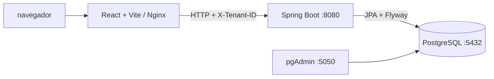
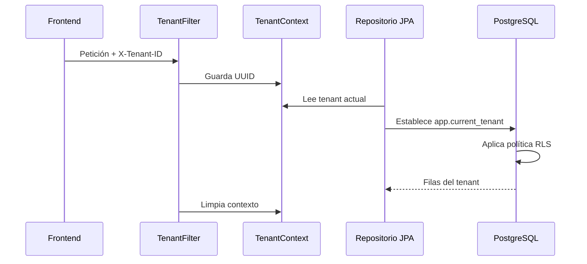

# KlinikPro

Plataforma clínica SaaS multitenant de CytoHelix Systems. El proyecto combina una API Spring Boot, una interfaz React y una infraestructura Docker con PostgreSQL para gestionar el dominio clínico, la separación por tenant y la interoperabilidad FHIR.

> **Estado actual:** el repositorio contiene un esqueleto funcional y demostrativo. La interfaz de login es visual, el módulo de agenda utiliza datos de presentación y el backend expone principalmente lectura/búsqueda FHIR de pacientes. La autenticación real, los CRUD completos y la autorización productiva todavía están pendientes.

## Contenido

- [Características actuales](#características-actuales)
- [Arquitectura](#arquitectura)
- [Tecnologías](#tecnologías)
- [Estructura del repositorio](#estructura-del-repositorio)
- [Requisitos previos](#requisitos-previos)
- [Inicio rápido con Docker](#inicio-rápido-con-docker)
- [Ejecución local por servicio](#ejecución-local-por-servicio)
- [Guía instructiva de uso](#guía-instructiva-de-uso)
- [Multitenancy y RLS](#multitenancy-y-rls)
- [API FHIR disponible](#api-fhir-disponible)
- [Base de datos y migraciones](#base-de-datos-y-migraciones)
- [Pruebas y validación](#pruebas-y-validación)
- [CI/CD](#cicd)
- [Solución de problemas](#solución-de-problemas)
- [Estado y próximos pasos](#estado-y-próximos-pasos)

## Características actuales

### Backend implementado

- Aplicación Spring Boot con Java 17.
- Persistencia con Spring Data JPA y PostgreSQL.
- Migraciones de esquema con Flyway.
- Entidades para tenants, sucursales, usuarios, profesionales, pacientes, citas y datos clínicos.
- Separación de tenant mediante la cabecera `X-Tenant-ID`.
- Contexto de tenant por petición usando `ThreadLocal`.
- Row-Level Security (RLS) en PostgreSQL para tablas multitenant.
- Servicio de citas con detección de solapamientos.
- Almacenamiento de documentos clínicos en `JSONB`.
- Conversión de pacientes internos a recursos FHIR.
- Endpoints FHIR `GET` para pacientes.

### Frontend implementado

- React 19 con TypeScript y Vite.
- React Router para navegación.
- Layout de dashboard con navegación lateral.
- Pantalla de login visual.
- Página de agenda inicial.
- Página de pacientes conectada al endpoint FHIR.
- Página de finanzas marcada como módulo en desarrollo.
- Cliente HTTP centralizado que agrega `X-Tenant-ID` desde `localStorage`.

### Infraestructura implementada

- PostgreSQL 16 sobre Alpine.
- pgAdmin.
- Dockerfiles multi-stage para backend y frontend.
- Nginx para servir el build de React.
- Docker Compose con base de datos, pgAdmin, backend y frontend.
- GitHub Actions para compilar backend y frontend.

## Arquitectura



En desarrollo se puede ejecutar React y Spring Boot directamente en el equipo. En el escenario contenedorizado, el frontend se sirve con Nginx y el backend se conecta a PostgreSQL usando el hostname Docker `db`, no `localhost`.

### Flujo de una petición multitenant



## Tecnologías

| Área | Tecnología | Versión o referencia |
| --- | --- | --- |
| Lenguaje backend | Java | 17 |
| Framework backend | Spring Boot | 3.2.3 |
| Build backend | Maven | 3.8+ recomendado |
| Persistencia | Spring Data JPA / Hibernate | Incluido en Spring Boot |
| Seguridad | Spring Security | Incluido en `pom.xml` |
| Base de datos | PostgreSQL | 16 Alpine |
| Migraciones | Flyway | Incluido en `pom.xml` |
| Interoperabilidad | HAPI FHIR | 6.10.0, R4 |
| Frontend | React | 19 |
| Bundler | Vite | 8 |
| Lenguaje frontend | TypeScript | 6 |
| Routing | React Router | 7 |
| Iconos | Lucide React | Incluido en `package.json` |
| Contenedores | Docker Compose | v2 recomendado |

## Estructura del repositorio

```text
KlinikPro-Cytohelix-Gemini/
├── .github/
│   └── workflows/ci.yml
├── backend/
│   ├── Dockerfile
│   ├── pom.xml
│   └── src/
│       └── main/
│           ├── java/com/cytohelix/klinikpro/
│           │   ├── config/security/
│           │   ├── domain/
│           │   │   ├── appointment/
│           │   │   ├── clinical/
│           │   │   ├── patient/
│           │   │   ├── practitioner/
│           │   │   ├── tenant/
│           │   │   └── user/
│           │   ├── fhir/
│           │   │   ├── common/
│           │   │   ├── config/
│           │   │   ├── controller/
│           │   │   ├── dto/
│           │   │   └── mapper/
│           │   └── KlinikProApplication.java
│           └── resources/
│               ├── application.yml
│               └── db/migration/
│                   ├── V1__init_schema_with_rls.sql
│                   ├── V2__add_patient_practitioner.sql
│                   └── V3__add_appointment.sql
├── frontend/
│   ├── Dockerfile
│   ├── package.json
│   ├── package-lock.json
│   ├── public/
│   └── src/
│       ├── api/
│       ├── assets/
│       ├── components/
│       ├── layouts/
│       ├── pages/
│       ├── App.tsx
│       └── main.tsx
├── docker-compose.yml
├── KliniKPro-Guide.md
└── README.md
```

La guía [KliniKPro-Guide.md](KliniKPro-Guide.md) contiene una explicación didáctica por fases y está pensada como material de aprendizaje complementario a este README.

## Requisitos previos

- Git.
- Java 17.
- Maven 3.8 o superior.
- Node.js 20 recomendado.
- npm.
- Docker Desktop con Docker Compose.
- PowerShell, Bash o una terminal equivalente.
- Opcional: Postman, Insomnia o `curl` para probar la API.

Verificación rápida en PowerShell:

```powershell
git --version
java -version
mvn -version
node --version
npm --version
docker --version
docker compose version
```

## Inicio rápido con Docker

Esta es la forma más sencilla de ejecutar el proyecto completo.

### 1. Levantar los servicios

Desde la raíz del repositorio:

```powershell
docker compose build
docker compose up -d
```

El primer comando construye las imágenes del backend y frontend. El segundo inicia los cuatro servicios.

### 2. Comprobar el estado

```powershell
docker compose ps
```

Servicios y puertos:

| Servicio | URL o conexión |
| --- | --- |
| Frontend | `http://localhost` |
| Backend | `http://localhost:8080` |
| pgAdmin | `http://localhost:5050` |
| PostgreSQL | `localhost:5432` |

### 3. Ver logs

```powershell
docker compose logs -f backend
docker compose logs -f frontend
docker compose logs -f db
```

### 4. Detener el entorno

Detener contenedores manteniendo los datos:

```powershell
docker compose down
```

Detener contenedores y eliminar el volumen de PostgreSQL:

```powershell
docker compose down -v
```

Usa `down -v` únicamente cuando quieras reiniciar la base de datos desde cero.

## Ejecución local por servicio

La ejecución separada es útil para desarrollar y depurar código.

### PostgreSQL y pgAdmin

Desde la raíz:

```powershell
docker compose up -d db pgadmin
```

### Backend con Maven

```powershell
cd backend
mvn clean install
mvn spring-boot:run
```

El backend escucha en `http://localhost:8080`.

Para ejecutar el JAR compilado:

```powershell
mvn clean package
java -jar target/klinikpro-0.0.1-SNAPSHOT.jar
```

### Frontend con Vite

En otra terminal:

```powershell
cd frontend
npm install
npm run dev
```

Vite mostrará la URL de desarrollo, normalmente `http://localhost:5173`.

Comandos adicionales:

```powershell
npm run build
npm run preview
npm run lint
```

## Guía instructiva de uso

### Paso 1: acceder a la aplicación

Con Docker completo, abre `http://localhost`. Con frontend local, abre la URL mostrada por Vite.

### Paso 2: utilizar el login de demostración

La pantalla inicial solicita usuario, contraseña y tenant ID. En el estado actual:

1. El usuario introduce un UUID de tenant.
2. El frontend guarda ese valor en `localStorage` bajo la clave `tenant_id`.
3. La aplicación navega al dashboard.
4. El cliente HTTP reutiliza el valor para enviar `X-Tenant-ID`.

El usuario y la contraseña **no se validan contra el backend actualmente**. Este login es una simulación visual para poder probar la navegación y el aislamiento de contexto.

Para probar el flujo se necesita un UUID válido de la tabla `tenant`:

```text
Tenant ID: <UUID-existente-en-la-base>
Usuario: demo
Contraseña: demo
```

### Paso 3: navegar por el dashboard

Las rutas actuales son:

| Ruta | Pantalla | Estado |
| --- | --- | --- |
| `/` | Login | Visual/demostrativo |
| `/dashboard` | Agenda | UI inicial con datos de presentación |
| `/dashboard/patients` | Pacientes | Consume `GET /fhir/Patient` |
| `/dashboard/finances` | Finanzas | Placeholder en desarrollo |

### Paso 4: consultar pacientes

Entra en `Pacientes`. La pantalla llama al cliente de `frontend/src/api/client.ts`, que:

- lee `tenant_id` desde `localStorage`;
- añade `X-Tenant-ID` a la petición;
- consulta `GET /fhir/Patient`;
- transforma la respuesta FHIR para mostrar folio, nombre, teléfono y estado.

Si no hay datos o la API no está disponible, la pantalla puede mostrarse vacía. La creación y edición de pacientes desde la interfaz todavía no están implementadas.

### Paso 5: revisar la agenda

La página de agenda muestra la intención funcional del módulo y la regla de prevención de citas solapadas. En el estado actual no existe un controlador REST de citas ni un formulario conectado al backend; los datos de la pantalla son de demostración.

### Paso 6: cerrar la sesión visual

El logout elimina `tenant_id` del `localStorage` y devuelve al usuario a `/`.

## Multitenancy y RLS

### Cabecera requerida

El backend reconoce:

```text
X-Tenant-ID: <UUID-del-tenant>
```

El filtro `TenantFilter` convierte el valor en UUID y lo guarda en `TenantContext`. Al finalizar la petición, el contexto se limpia en un bloque `finally` para evitar que un hilo reutilizado conserve el tenant anterior.

### Aislamiento en PostgreSQL

`RlsAspect` establece la configuración local `app.current_tenant` antes de la operación de repositorio. Las políticas de PostgreSQL comparan ese valor con `tenant_id`.

Tablas con RLS en las migraciones actuales:

- `branch`
- `app_user`
- `clinical_data`
- `practitioner`
- `patient`
- `appointment`

Ejemplo de petición en PowerShell:

```powershell
$headers = @{
  "X-Tenant-ID" = "<UUID-del-tenant>"
  "Accept" = "application/fhir+json"
}
Invoke-RestMethod -Uri "http://localhost:8080/fhir/Patient" -Headers $headers
```

> **Advertencia de seguridad:** en este prototipo el navegador puede enviar libremente el UUID de tenant. Para producción, el tenant debe derivarse de una identidad autenticada mediante sesión o JWT, con autorización por rol y validación en el servidor.

## API FHIR disponible

El controlador actual publica respuestas con `application/fhir+json`.

### Buscar pacientes

```http
GET /fhir/Patient
Accept: application/fhir+json
X-Tenant-ID: <UUID-del-tenant>
```

Con `curl`:

```bash
curl -H "Accept: application/fhir+json" \
     -H "X-Tenant-ID: <UUID-del-tenant>" \
     http://localhost:8080/fhir/Patient
```

### Obtener un paciente

```http
GET /fhir/Patient/{id}
Accept: application/fhir+json
X-Tenant-ID: <UUID-del-tenant>
```

```bash
curl -H "Accept: application/fhir+json" \
     -H "X-Tenant-ID: <UUID-del-tenant>" \
     http://localhost:8080/fhir/Patient/{id}
```

El UUID del paciente debe existir y pertenecer al tenant de la petición. Actualmente no hay endpoints públicos documentados para crear, actualizar o eliminar pacientes.

## Dominio y reglas de negocio

### Entidades

- `Tenant`: clínica u organización cliente.
- `Branch`: sucursal perteneciente a un tenant.
- `AppUser`: usuario del sistema, con rol y hash de contraseña almacenado.
- `Practitioner`: profesional clínico.
- `Patient`: paciente asociado a tenant, sucursal y profesional tratante.
- `Appointment`: cita con paciente, profesional, estado y rango horario.
- `ClinicalData`: documento clínico flexible con payload FHIR en JSONB.

### Prevención de solapamientos

`AppointmentService` busca citas del mismo profesional que se crucen con el intervalo solicitado. La regla conceptual es:

```text
solapamiento = citaExistente.inicio < nueva.fin
               Y citaExistente.fin > nueva.inicio
```

Por tanto, una cita de `09:00-10:00` colisiona con `09:30-10:30`, pero no con `10:00-11:00`. La regla existe en el servicio, aunque todavía no está expuesta mediante un controlador REST de citas.

## Base de datos y migraciones

La configuración local del backend está en `backend/src/main/resources/application.yml`:

```yaml
spring:
  datasource:
    url: jdbc:postgresql://localhost:5432/klinikpro
    username: kpro_admin
    password: password123
server:
  port: 8080
```

Cuando se ejecuta dentro de Docker Compose, las variables del servicio `backend` sustituyen la URL para usar `jdbc:postgresql://db:5432/klinikpro`.

### Migraciones actuales

| Migración | Contenido |
| --- | --- |
| `V1__init_schema_with_rls.sql` | `tenant`, `branch`, `app_user`, `clinical_data` y políticas RLS iniciales |
| `V2__add_patient_practitioner.sql` | `patient`, `practitioner` y políticas RLS correspondientes |
| `V3__add_appointment.sql` | `appointment` y su política RLS |

Flyway se ejecuta al arrancar Spring Boot. Hibernate usa `ddl-auto: validate`, por lo que valida el esquema y no lo modifica automáticamente.

### pgAdmin

Accede a `http://localhost:5050`:

- Email: `admin@cytohelix.com`
- Contraseña: `admin`

Desde pgAdmin, al registrar el servidor Docker usa:

- Host: `db`
- Puerto: `5432`
- Base: `klinikpro`
- Usuario: `kpro_admin`
- Contraseña: `password123`

## Pruebas y validación

### Backend

```powershell
cd backend
mvn test
mvn clean package
```

El build actual de CI utiliza `mvn clean package -DskipTests`, por lo que las pruebas automáticas deben ampliarse antes de considerar el pipeline como validación completa del comportamiento.

### Frontend

```powershell
cd frontend
npm ci
npm run lint
npm run build
```

### Validación manual mínima

1. Comprobar `docker compose ps`.
2. Confirmar que Flyway aplicó `V1`, `V2` y `V3`.
3. Confirmar que el backend arranca en el puerto 8080.
4. Consultar `GET /fhir/Patient` con `X-Tenant-ID`.
5. Revisar en el navegador que Pacientes envía la cabecera esperada.
6. Probar que las rutas `/dashboard` y `/dashboard/patients` funcionan al recargar.
7. Ejecutar los builds de Maven y npm.

## CI/CD

El workflow [.github/workflows/ci.yml](.github/workflows/ci.yml) se ejecuta en `push` y `pull_request` hacia `main` y `master`.

### Job de backend

- Ubuntu.
- Java 17 Temurin.
- Caché de Maven.
- `mvn clean package -DskipTests`.

### Job de frontend

- Ubuntu.
- Node 20.
- Caché de npm usando `frontend/package-lock.json`.
- `npm ci`.
- `npm run build`.

## Solución de problemas

### PostgreSQL no inicia

```powershell
docker compose ps
docker compose logs db
```

Comprueba que el puerto `5432` no esté ocupado y que Docker Desktop esté iniciado.

### Backend no conecta con la base

- En ejecución local, usa `localhost` en `application.yml`.
- En Docker, usa el hostname `db`.
- Comprueba las credenciales `kpro_admin` / `password123`.
- Espera a que PostgreSQL esté listo antes de revisar los logs del backend.

### El frontend no llega al backend

El cliente actual tiene la URL fija `http://localhost:8080`. Si el backend está en otra URL, hay que parametrizar `API_BASE_URL` por entorno antes de desplegar.

### El frontend en Docker devuelve 404 al recargar una ruta

El Dockerfile ya genera una configuración Nginx con `try_files` para React Router. Si se modifica Nginx, debe conservarse la redirección hacia `/index.html`.

### Flyway falla después de modificar la base

No edites migraciones ya aplicadas en un entorno compartido. Crea una nueva migración con el siguiente número, por ejemplo `V4__descripcion.sql`. Para reiniciar completamente un entorno local:

```powershell
docker compose down -v
docker compose up -d
```

### Hay una pantalla vacía

Revisa la consola del navegador, que el backend esté activo y que `localStorage` contenga `tenant_id`. La pantalla de pacientes requiere un tenant válido y datos visibles para ese tenant.

## Desarrollo y contribución

Flujo recomendado:

1. Crear una rama para la funcionalidad.
2. Modificar backend, frontend y migraciones de forma coordinada.
3. Ejecutar `mvn test` y `npm run build`.
4. Probar manualmente el flujo multitenant.
5. Actualizar este README si cambian comandos, rutas, puertos o funcionalidades.
6. Abrir un pull request y esperar el workflow de CI.

Buenas prácticas:

- No guardar secretos reales en `docker-compose.yml` ni en el repositorio.
- No usar la cabecera enviada por el navegador como mecanismo de autenticación en producción.
- Crear migraciones nuevas en lugar de reescribir migraciones aplicadas.
- Mantener la lógica de negocio en servicios, persistencia en repositorios y transporte HTTP en controladores.
- Añadir pruebas de integración para validar aislamiento entre tenants.

## Estado y próximos pasos

### Disponible hoy

- Persistencia multitenant con PostgreSQL y RLS.
- Dominio base de pacientes, profesionales, citas y datos clínicos.
- Regla de solapamiento de citas en servicio.
- Lectura y búsqueda FHIR de pacientes.
- Dashboard React inicial.
- Ejecución local y contenedorizada.
- Compilación automática de backend y frontend.

### Pendiente para una versión productiva

- Autenticación real con sesión o JWT.
- Autorización por rol y permisos.
- Derivación segura del tenant desde la identidad autenticada.
- CRUD REST de pacientes, profesionales y citas.
- Agenda conectada al backend.
- Alta y consulta pública de `ClinicalData` con validación FHIR completa.
- Pruebas unitarias y de integración, especialmente de RLS.
- Health checks y orden de disponibilidad de servicios Docker.
- CORS y URLs configurables por entorno.
- Gestión segura de secretos.
- Observabilidad, auditoría y despliegue cloud.

## Licencia y ownership

Proyecto asociado a CytoHelix Systems y KlinikPro. No se declara una licencia open source en este repositorio; antes de distribuirlo externamente debe definirse la política de licencia y uso.

## Accesos rápidos

- Aplicación Docker: `http://localhost`
- Frontend Vite: `http://localhost:5173`
- API: `http://localhost:8080`
- pgAdmin: `http://localhost:5050`
- Guía de aprendizaje: [KliniKPro-Guide.md](KliniKPro-Guide.md)
